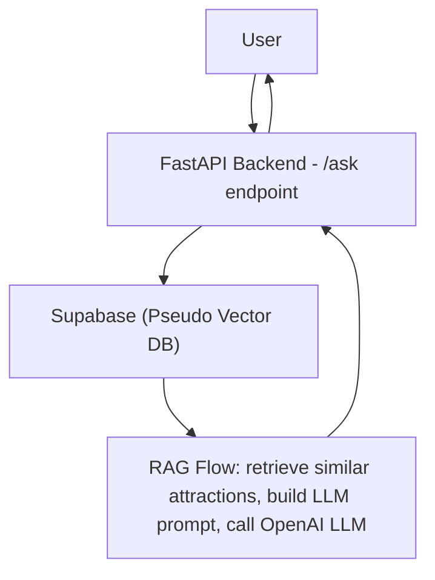

# Trip Planner

A simple RAG application as I go from a physics major to an AI engineer. 

## Problem

I like to travel and have a lot of attractions I want to tick off (I have a spreadsheet of over a thousand), wanted a simple app that I can use to find which cities I may need to travel to to tick off these attractions in the order I want.

## Stack

Simple RAG

**Flow:**  
User sends a query from the frontend → FastAPI backend receives it → Backend queries the pseudo vector DB for similar attractions → RAG logic creates a context prompt and calls the LLM → Response goes back to the user.
